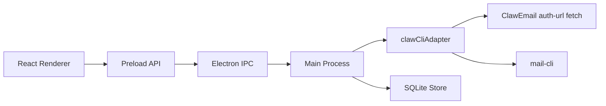

# ClawInbox Architecture

## 1. Overview

ClawInbox is an Electron desktop app with a React renderer, a TypeScript main process, and a local SQLite persistence layer. The first phase ships a mock UI and stable interfaces. Real ClawEmail command integration will be added behind the same `clawCliAdapter` contract.

## 2. Process Boundaries

### Renderer

- Renders UI only.
- Collects auth-url input.
- Calls `window.clawInbox` preload APIs.
- Clears auth-url state after add/import attempts.
- Never imports `child_process`, `execa`, Node filesystem APIs, or SQLite directly.

### Preload

- Exposes a narrow `window.clawInbox` API through `contextBridge`.
- Uses IPC channels only.
- Keeps TypeScript types shared with renderer.

### Main Process

- Owns all command execution.
- Owns SQLite access.
- Registers IPC handlers.
- Converts adapter and storage errors into Chinese user-facing errors.
- Ensures auth-url is never logged or persisted.

## 3. Claw CLI Adapter Contract

All ClawEmail command access is encapsulated in `src/main/clawCliAdapter.ts`.

Responsibilities:

- Initialize one profile from auth-url.
- Refresh one profile.
- Refresh all profiles.
- List profiles.
- List unified messages.
- Fetch one message body.
- Run diagnostics.

Security rules:

- Use `execa` or `spawn`.
- Use argument arrays.
- Use `shell: false`.
- Do not log auth-url.
- Do not include auth-url in thrown error messages.

Current phase:

- `createRealClawCliAdapter` is the default runtime adapter.
- `createMockClawCliAdapter` is retained for tests and can be enabled with `CLAWINBOX_ADAPTER=mock`.
- `CLAWINBOX_MAIL_CLI_PATH` can point to a specific `mail-cli` binary. If no local binary is found, the adapter falls back to `npx --yes @clawemail/mail-cli@latest`.

Real commands used:

- Profile init: fetch the parsed `t1/...` auth-url payload, then call mail-cli profile setup commands.
- API key: `mail-cli auth apikey set <api-key>`
- Profile login: `mail-cli --profile <profile> auth login --user <email>`
- Profile scan: `mail-cli --json auth list`
- Mail list: `mail-cli --profile <profile> --json mail list --fid INBOX --desc --limit 50`
- Body read: `mail-cli --profile <profile> --json read body --id <message-id> --fid INBOX`
- Body fallback: `mail-cli --profile <profile> --json mail get --ids <message-id> --fid INBOX`

All commands use argument arrays, `shell: false`, and bounded timeouts.

`@clawemail/claw-setup` was inspected and is not used for ClawInbox profile initialization because it treats OpenClaw plugin/channel/agent installation as a critical path before its optional mail-cli setup phase.

## 4. IPC API

The renderer sees this API:

- `listProfiles(): Promise<MailboxProfile[]>`
- `listUnifiedInbox(): Promise<MailSummary[]>`
- `getMessage(messageId): Promise<MailDetail>`
- `refreshProfile(profileId): Promise<SyncResult>`
- `refreshAll(): Promise<SyncResult[]>`
- `addMailbox({ authUrl }): Promise<InitializeProfileResult>`
- `importMailboxes({ authUrls }): Promise<InitializeProfileResult[]>`
- `getDiagnostics(): Promise<DiagnosticItem[]>`

The IPC layer is additive by design. Future commands should add methods instead of changing existing response shapes.

## 5. SQLite Persistence Design

Implemented tables:

### profiles

- `id`
- `profile_name`
- `email_address`
- `display_name`
- `status`
- `last_sync_at`
- `created_at`
- `updated_at`

### messages

- `id`
- `profile_id`
- `external_id`
- `from_name`
- `from_address`
- `subject`
- `received_at`
- `is_read`
- `has_attachments`
- `snippet`
- `body_text`
- `created_at`
- `updated_at`

### sync_runs

- `id`
- `profile_id`
- `status`
- `started_at`
- `finished_at`
- `message`

The database must never include auth-url.

Startup behavior:

- Renderer first reads cached profiles and messages through IPC.
- Renderer then triggers `refreshAll()` in the background through IPC.
- Main process refreshes real profile/mail data and writes SQLite.
- Renderer reloads cached data after background refresh completes.
- If refresh fails, existing cached profiles/messages remain visible and profile sync status is updated to failed.

Sync state:

- `READY` means the latest sync attempt succeeded.
- `SYNCING` means a refresh is in progress.
- `ERROR` means the latest sync attempt failed, while cached data is retained.
- `unread_count` is stored on `profiles` after successful message refresh.

## 6. Error Model

Errors shown in the UI should be Chinese, short, and actionable.

Examples:

- `未检测到 Node.js，请先安装 Node.js。`
- `npx 不可用，请确认 Node.js 安装完整。`
- `ClawEmail profile 无法读取，请检查本机授权状态。`
- `同步失败，请稍后重试或打开状态诊断查看原因。`

Internal errors may keep diagnostic details in memory, but logs must redact or omit secrets.

## 7. First Phase Runtime Choice

The first phase defaults to mock data so UI, IPC, and contracts can stabilize before wiring real commands. Real command execution is implemented behind the adapter boundary and can be enabled in a later milestone after SQLite migrations and profile discovery behavior are verified.
